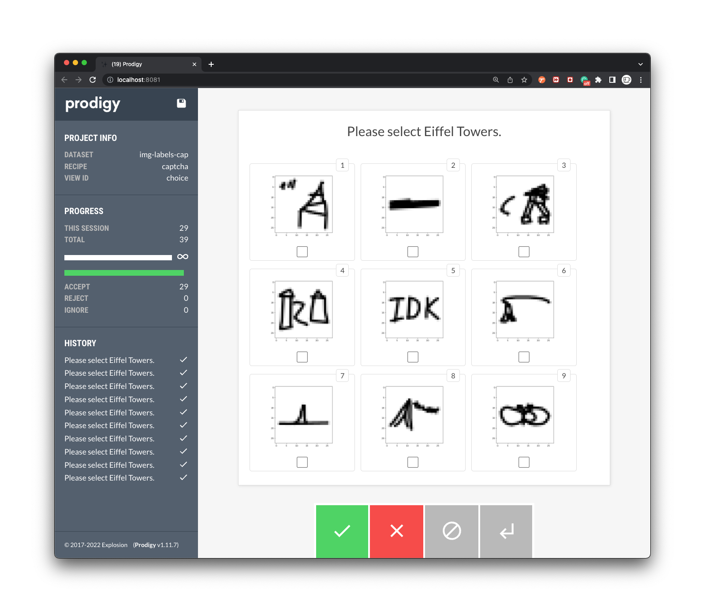

# prodigy-bad-img-demo

This project contains a few recipes to find bad examples in the [QuickDraw dataset](https://github.com/googlecreativelab/quickdraw-dataset). In particular, we will try to find bad drawings of the Eiffel tower.



If you're curious, this project is the end-result of [this Youtube tutorial](https://youtu.be/s0Y45xscE-0). Check it out if you want to learn more about prodigy!

## Installation 

The installation process is automated via `make`.

```bash
# Install all dependencies
make install
# Download the QuickDraw data
make download
```

In order for the install to work, you'll need to
add a `.env` file to the root of the project that
contains your prodigy license key. It should look
something like:

```
PRODIGY_KEY="1234-ABCD-5678-EFGH"
```

## Contents 

The project has a few notable files/folders: 

- The `recipes` folder contains prodigy recipes along with some associated templates. These are used to generate an appropriate UI for the "bad example"-finding task. 
- The `data` folder contains `.jsonl` files with likely duplicate records. These have been generated using a heuristic found in the `quickdraw.ipynb` notebook. Feel free to check it because there's an indepth guide on the algorithmic details in there!

## Usage

You can run prodigy via `make` too. 

```bash
# Start the image server, which needs to run first.
make image-server

# Given a running image server, run prodigy in one-by-one mode.
make prodigy-single

# Given a running image server, run prodigy in captcha mode.
make prodigy-captcha
```